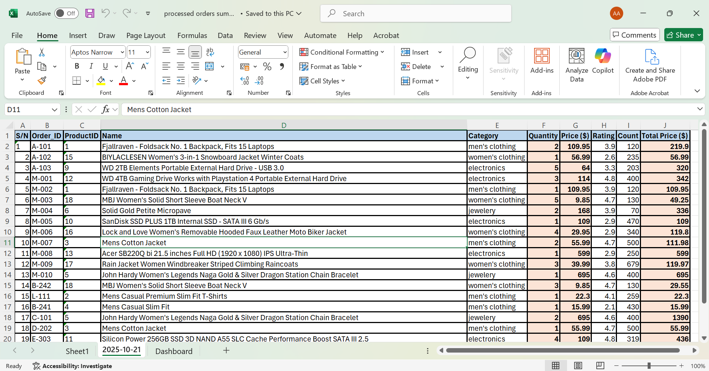

# automated-sales-reporter

# Automated E-commerce Order Processor \& Reporting Dashboard





This project is an end-to-end Python automation script that processes raw e-commerce order files, enriches the data via a live API, and generates a formatted daily sales report in Excel with an executive dashboard.

---

##  The Problem

Many e-commerce businesses receive daily orders from multiple sources, resulting in a messy and inconsistent mix of data formats. 

A manager might get structured `.csv` files from one platform and poorly formatted `.txt` receipts from a legacy system. 

Manually consolidating, cleaning, and analyzing this data every day is time-consuming, tedious, and highly prone to human error. 

This manual process creates a bottleneck, delaying crucial business insights.

---


## The Solution

This script completely simplifies the order processing pipeline. It acts as a virtual assistant that works to:

1.  **Scan for New Files:** Scan an `incoming_orders` folder for new `.csv` or `.txt` order files.

2.  **Parse and Clean Data:**

	* Intelligently parses structured `.csv` files.

	* Uses robust **Regular Expressions (Regex)** to extract key information (Order ID, Product ID, Quantity) from messy, unstructured `.txt` files.

3.  **Enrich Data with an API:** Takes the extracted `ProductID` and makes a real-time call to the [Fake Store API](https://fakestoreapi.com/) to fetch rich product details like name, price, and category. This can be tailored to company's use.

4.  **Generate a Polished Excel Report:** Creates a new sheet in an Excel workbook for the current day's sales, containing all the clean and enriched order data.

5.  **Build a Dynamic Dashboard:** Populates a separate "Dashboard" sheet with key performance indicators (KPIs) like Total Revenue, Total Items Sold, and Sales by Category. This dashboard uses **Excel formulas** so the data is dynamic and interactive.

6.  **Archive Processed Files:** After processing, the script moves the raw files into a dated archive folder to prevent re-processing and maintain a clean workspace.

---


##  How to Use

Follow these steps to set up and run the project on your local machine.


### 1. Prerequisites

* Python 3.8 or newer

* An IDE like VS Code or PyCharm


### 2. Setup

Clone the repository to your local machine:

```bash

git clone \[https://github.com/Abdul-adeiza/automated-sales-reporter.git](https://github.com/Abdul-adeiza/automated-sales-reporter.git)

cd automated-sales-reporter


### 3. Install Dependencies

> openpyxl


### 4. Folder Structure

The script expects a specific folder structure. Please create the following folders in the root directory of the project:


> incoming_orders/: Place your raw .csv and .txt order files here.
> archive/: This folder will be used by the script to store processed files.


### 5. Run the Script

Execute the main Python script from your terminal:

> python main.py

The script will generate/update the processed\_orders\_summary.xlsx file in the root directory.


### 6. Sample Output

The script produces a clean, multi-sheet Excel workbook.

 > Detailed Orders Sheet
 > Executive Dashboard


